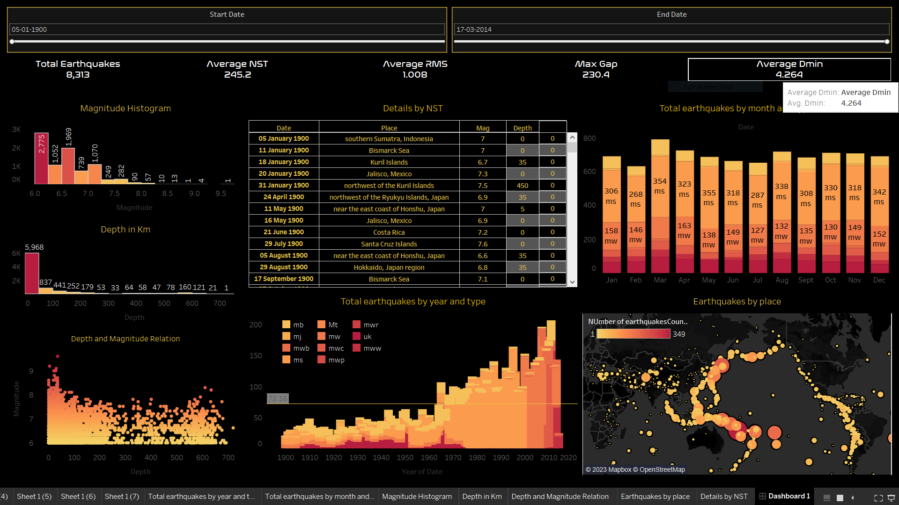

# Tableau-Dashboards
This is a repository which contains all my Tableau Dashboards.\
The Dashboards in this repository can also be found on my Tableau page : [Here](https://public.tableau.com/app/profile/tanmaychk)
## Index :
    
1. [Earthquake Analysis 1900-2014](https://public.tableau.com/app/profile/tanmaychk/viz/EarthquakeAnalysis1900-2014_16904438040080/Dashboard1)

-------------------------
## Data :

All the data files (.cvs, .xlsx) are also uploaded in the **input** folder.
These datasets can also be found on their kaggle pages :  

- [Earthquake Analysis 1900-2014](https://www.kaggle.com/datasets/usamabuttar/significant-earthquakes) 
--------------------------
## Preview :
-Earthwuake Analysis\
    
